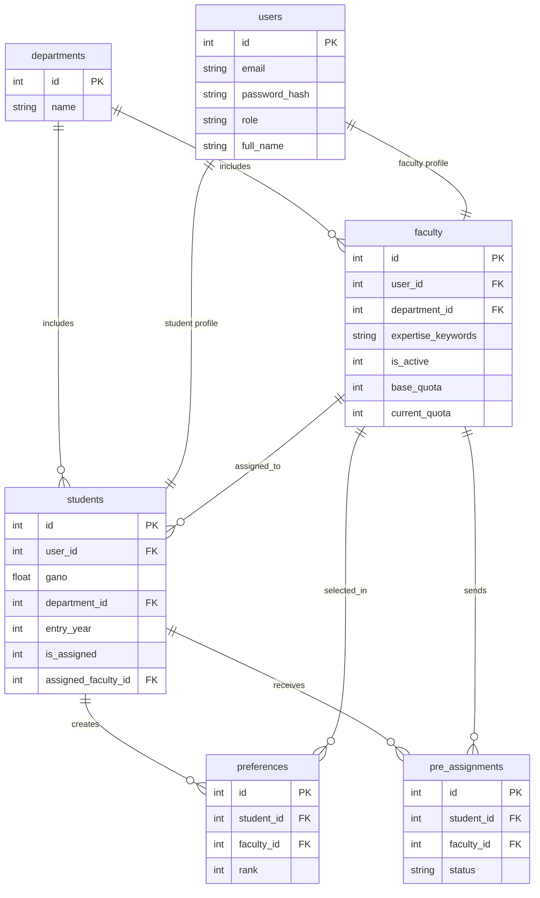
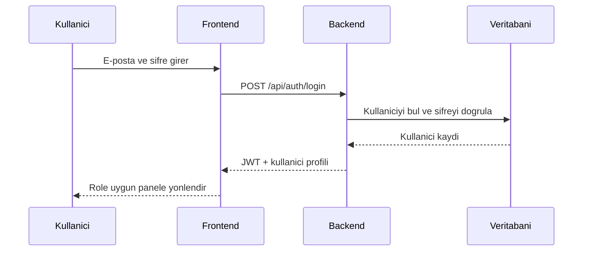
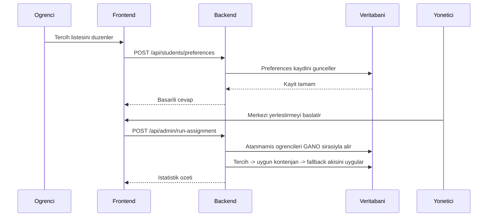

# Danisman Atama Sistemi

Danisman Atama Sistemi, ogrenci tercihlerinin, manuel danisman tekliflerinin ve merkezi yerlestirme surecinin tek bir kurumsal panel uzerinden yonetilmesi icin gelistirilmis bir web uygulamasidir. Sistem, otomatik yerlestirme akisinda yalnizca `GANO` onceligini esas alir; bunun disindaki tek istisna, danismanin manuel teklif gondermesi ve ogrencinin bu teklifi kabul etmesidir.

## Icerik

- [Genel Kapsam](#genel-kapsam)
- [Teknoloji Yigini](#teknoloji-yigini)
- [Dizin Yapisi](#dizin-yapisi)
- [Hizli Baslangic](#hizli-baslangic)
- [Ornek Hesaplar](#ornek-hesaplar)
- [Veri Modeli](#veri-modeli)
- [ER Diyagrami](#er-diyagrami)
- [Sistem Akislari](#sistem-akislari)
- [Is Kurallari](#is-kurallari)
- [API Ozeti](#api-ozeti)
- [Test Senaryolari](#test-senaryolari)
- [Deploy Notlari](#deploy-notlari)
- [Mevcut Sinirlar](#mevcut-sinirlar)

## Genel Kapsam

Sistem uc ana rol uzerinden calisir:

- `Yonetici`: kontenjan hesaplar, merkezi yerlestirmeyi calistirir, kullanici siler, danismani aktif/pasif yapar ve manuel yeniden atama yapar.
- `Danisman`: atanmis ogrencilerini gorur, minimum GANO filtreli ogrenci aramasi yapar ve uygun ogrencilere manuel teklif gonderir.
- `Ogrenci`: aktif danisman havuzunu gorur, tercih listesi olusturur, gerekirse gelen manuel teklifi kabul ya da reddeder.

Bu surumde uygulama:

- mevcut stack uzerinde calisir: `React + Vite`, `Node.js + Express`, `SQLite`
- merkezi yerlestirmede yalnizca `GANO` kriterini kullanir
- danisman aktif/pasif durumunu yonetir
- donem icinde manuel danisman degisikligi yapilmasina izin verir
- sifre degistirme akisini tum roller icin destekler

## Teknoloji Yigini

- `Frontend`: React 19, React Router, Axios, Lucide React, Vite
- `Backend`: Node.js, Express 5, JWT, bcryptjs
- `Veritabani`: SQLite (`better-sqlite3`)
- `Dokumantasyon`: Markdown + Mermaid

## Dizin Yapisi

```text
.
├── backend
│   ├── db
│   │   ├── database.js
│   │   ├── schema.sql
│   │   └── seed.sql
│   ├── engine
│   │   └── assignment.js
│   ├── middleware
│   │   └── auth.js
│   ├── routes
│   │   ├── admin.js
│   │   ├── auth.js
│   │   ├── faculty.js
│   │   └── students.js
│   ├── .env.example
│   ├── package.json
│   └── server.js
├── frontend
│   ├── src
│   │   ├── components
│   │   ├── pages
│   │   ├── App.jsx
│   │   ├── api.js
│   │   └── index.css
│   ├── .env.example
│   └── package.json
├── docs
│   ├── architecture.md
│   └── test-scenarios.md
└── README.md
```

Not:

- `frontend_cra` klasoru calisma akisinin parcasi degildir. Aktif arayuz `frontend` altindaki Vite uygulamasidir.
- `docs/architecture.md` ve `docs/test-scenarios.md` dosyalari README icindeki mimari ve test maddelerinin ayri kopyalaridir.

## Hizli Baslangic

### 1. Repoyu klonla

```bash
git clone https://github.com/pnarkz/danisman_atama.git
cd danisman_atama
```

### 2. Backend ortamini hazirla

```bash
cd backend
npm install
Copy-Item .env.example .env
npm start
```

Beklenen servis:

- `http://localhost:3000`

Backend ilk acilista:

- veritabani semasini olusturur
- gerekli migrasyonlari uygular
- bos veritabani durumunda ornek verileri yukler

### 3. Frontend ortamini hazirla

Yeni bir terminal acin:

```bash
cd frontend
npm install
Copy-Item .env.example .env
npm start
```

Beklenen arayuz:

- `http://localhost:5173`

### 4. Ortam degiskenleri

`backend/.env.example`

```env
PORT=3000
JWT_SECRET=danisman-atama-secret-key-2024
```

`frontend/.env.example`

```env
VITE_API_BASE_URL=http://localhost:3000/api
```

## Ornek Hesaplar

| Rol | E-posta | Sifre |
| --- | --- | --- |
| Yonetici | `admin@ankara.edu.tr` | `admin123` |
| Danisman | `ahmet.yilmaz@ankara.edu.tr` | `hoca123` |
| Ogrenci | `ogrenci01@ankara.edu.tr` | `ogrenci123` |

`seed.sql` icinde toplam:

- `1` yonetici
- `10` danisman
- `50` ogrenci
- `3` bolum

tanimli gelir.

## Veri Modeli

Temel tablolar:

- `departments`: bolum tanimlari
- `users`: ortak kullanici kaydi
- `students`: ogrenciye ozgu alanlar (`gano`, `entry_year`, `assigned_faculty_id`)
- `faculty`: danismana ozgu alanlar (`expertise_keywords`, `base_quota`, `current_quota`, `is_active`)
- `preferences`: ogrenci tercih siralamasi
- `pre_assignments`: danismanin ogrenciye gonderdigi manuel teklifler
- `assignment_logs`: yonetsel ve operasyonel hareket kayitlari

## ER Diyagrami



## Sistem Akislari

### Giris akis diyagrami



### Ogrenci tercih kaydi ve merkezi yerlestirme



## Is Kurallari

### 1. Otomatik yerlestirme

- merkezi yerlestirme yalnizca `GANO DESC` sirasina gore calisir
- esitlik durumunda daha dusuk `id` degerine sahip ogrenci once islenir
- yerlesme sirasinda ogrencinin tercih listesi takip edilir
- tercihleri doluysa aktif danismanlar arasinda kalan kontenjani en yuksek olan danismana fallback uygulanir

### 2. Manuel teklif istisnasi

- danisman, sadece aktif durumdaysa ve kontenjani dolu degilse ogrenciye teklif gonderebilir
- ogrenci teklifi kabul ederse atama hemen kesinlesir
- ogrenci manuel teklifi reddederse merkezi yerlestirme akisina geri doner

### 3. Kontenjan dagitimi

- kontenjan hesabina yalnizca aktif danismanlar dahil edilir
- dagitim dengeli yapilir
- ortalama kapasite etrafinda `x+1 / x / x-1` mantigi uygulanir
- toplam ogrenci sayisi aktif danisman sayisindan buyuk veya esit ise hicbir aktif danisman `0` kontenjan ile birakilmaz

### 4. Danisman aktif/pasif durumu

- pasif danisman yeni teklif gonderemez
- pasif danisman otomatik yerlestirme havuzuna dahil edilmez
- mevcut atamalari gorulebilir, ancak yeni atama alamaz

### 5. Donem ici danisman degisikligi

- yonetici, `force-assign` islemi ile ogrenciyi baska aktif danismana tasiyabilir
- onceki danismanin `current_quota` degeri azaltilir
- yeni danismanin `current_quota` degeri artirilir

### 6. Kullanici silme kurallari

- son kalan yonetici silinemez
- aktif ogrencisi veya bekleyen teklifi olan danisman dogrudan silinemez
- silinen ogrencinin tercih ve log baglantilari da temizlenir

### 7. Sifre degistirme

- tum roller kendi sifresini degistirebilir
- yeni sifre icin minimum uzunluk `8` karakterdir

## API Ozeti

### Kimlik dogrulama

- `POST /api/auth/login`
- `POST /api/auth/register`
- `POST /api/auth/change-password`

### Ogrenci

- `GET /api/students/me`
- `GET /api/students/faculty-list`
- `GET /api/students/preferences`
- `POST /api/students/preferences`
- `GET /api/students/invitations`
- `POST /api/students/invitations/:id/respond`

### Danisman

- `GET /api/faculty/me`
- `GET /api/faculty/students`
- `POST /api/faculty/invite`
- `GET /api/faculty/assigned`

### Yonetici

- `POST /api/admin/calculate-quotas`
- `POST /api/admin/run-assignment`
- `POST /api/admin/force-assign`
- `GET /api/admin/results`
- `GET /api/admin/export`
- `GET /api/admin/logs`
- `GET /api/admin/get_dashboard_data`
- `GET /api/admin/users`
- `GET /api/admin/faculty-overview`
- `PATCH /api/admin/faculty/:id/status`
- `DELETE /api/admin/users/:id`

## Test Senaryolari

Word dokumanindaki maddeler esas alinarak takip edilmesi gereken senaryolar:

### Temel yonetim

1. Yonetici girisi basarili olmali.
2. Yonetici bir kullaniciyi sildiginde kullanici veritabani kaydindan da kalkmali.
3. Son kalan yonetici silinmeye calisildiginda sistem engel koymali.

### Ornek veri senaryosu

1. `40` ogrenci, `9` ogretim uyesi ve `1` yonetici ile test ortami kurulabilir.
2. Dokuzuncu tercih uzerinden yerlestirme davranisi gozlemlenmeli.
3. Bir danisman fazla tercih aldiginda kontenjan ve fallback mantigi kontrol edilmeli.

### Operasyonel senaryolar

1. Bos kontenjan oldugunda fallback atama calismali.
2. Danisman donem ortasinda ayrildiginda `pasif` duruma alinip ogrenciler manuel olarak yeniden atanabilmeli.
3. Danisman aktif/pasif gecisleri yeni teklif ve merkezi yerlestirme havuzunu dogru etkilemeli.
4. Danisman degisikligi yonetici panelinden kayitli ogrenci uzerinde uygulanabilmeli.
5. Sifre degistirme senaryosu tum roller icin calismali.

### Alan ve bolum senaryolari

1. Bolum bilgisinin ogrenci ve danisman tablolarinda tutarli oldugu kontrol edilmeli.
2. Farkli bolumlerden ogrenci ve danismanlarla ek senaryo datasi denenmeli.

## Deploy Notlari

Bu proje su an icin tek makine veya kucuk olcekli kurum ici dagitim hedefiyle uygun durumdadir.

### Basit uretim yaklasimi

1. Backend servisini `node server.js` veya bir process manager ile ayaga kaldirin.
2. Frontend icin `npm run build` ciktisini ters proxy arkasinda sunun.
3. Backend icin `PORT` ve `JWT_SECRET`, frontend icin `VITE_API_BASE_URL` degiskenlerini ortama tanimlayin.
4. `backend/db` altindaki SQLite verisini yedekleme takvimine alin.

### Tavsiye edilen operasyon notlari

- ters proxy: `Nginx` veya `Caddy`
- process manager: `pm2` veya sistem servisi
- duzenli yedek: `danisman_atama.db`
- log takibi: uygulama loglari + `assignment_logs` tablosu

## Mevcut Sinirlar

- E-posta bildirimi gereksinimi su an bilincli olarak uygulanmadi. Dokumanda da belirsiz olarak isaretlenmistir.
- Otomatik test altyapisi henuz eklenmedi; test senaryolari README icinde operasyonel kontrol listesi olarak tutuluyor.
- Sistem halen SQLite kullanir. Daha buyuk olcekli kullanim icin PostgreSQL migrasyonu sonraki faz olabilir.
