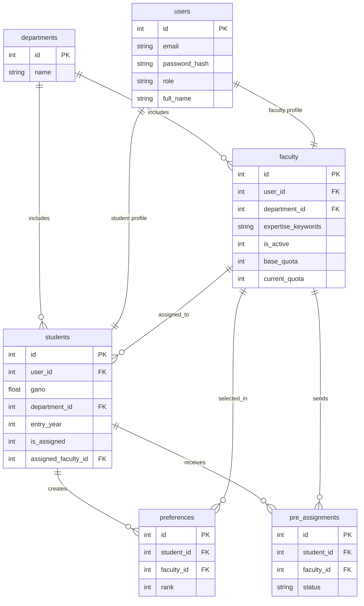
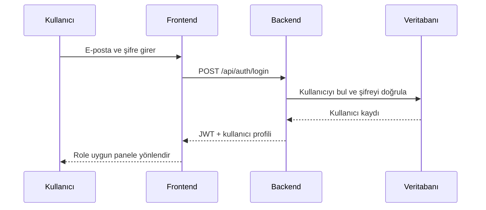
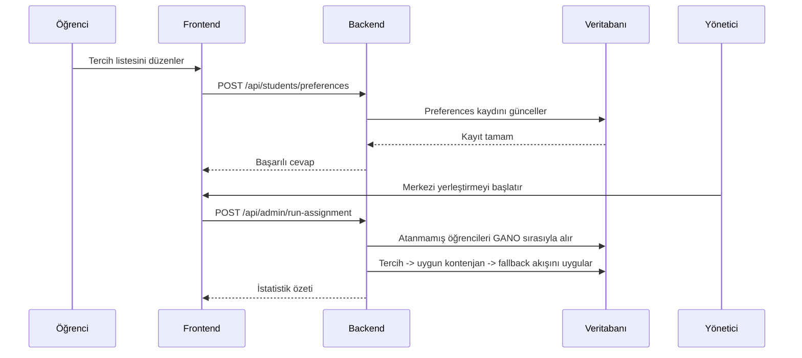

# Danışman Atama Sistemi

Danışman Atama Sistemi, öğrenci tercihlerinin, manuel danışman tekliflerinin ve merkezi yerleştirme sürecinin tek bir kurumsal panel üzerinden yönetilmesi için geliştirilmiş bir web uygulamasıdır. Sistem, otomatik yerleştirme akışında yalnızca `GANO` önceliğini esas alır; bunun dışındaki tek istisna, danışmanın manuel teklif göndermesi ve öğrencinin bu teklifi kabul etmesidir.

## İçerik

- [Genel Kapsam](#genel-kapsam)
- [Teknoloji Yığını](#teknoloji-yığını)
- [Dizin Yapısı](#dizin-yapısı)
- [Hızlı Başlangıç](#hızlı-başlangıç)
- [Örnek Hesaplar](#örnek-hesaplar)
- [Veri Modeli](#veri-modeli)
- [ER Diyagramı](#er-diyagramı)
- [Sistem Akışları](#sistem-akışları)
- [İş Kuralları](#iş-kuralları)
- [API Özeti](#api-özeti)
- [Test Senaryoları](#test-senaryoları)
- [Deploy Notları](#deploy-notları)
- [Mevcut Sınırlar](#mevcut-sınırlar)

## Genel Kapsam

Sistem üç ana rol üzerinden çalışır:

- `Yönetici`: kontenjan hesaplar, merkezi yerleştirmeyi çalıştırır, kullanıcı siler, danışmanı aktif/pasif yapar ve manuel yeniden atama yapar.
- `Danışman`: atanmış öğrencilerini görür, minimum GANO filtreli öğrenci araması yapar ve uygun öğrencilere manuel teklif gönderir.
- `Öğrenci`: aktif danışman havuzunu görür, tercih listesi oluşturur, gerekirse gelen manuel teklifi kabul ya da reddeder.

Bu sürümde uygulama:

- mevcut stack üzerinde çalışır: `React + Vite`, `Node.js + Express`, `SQLite`
- merkezi yerleştirmede yalnızca `GANO` kriterini kullanır
- danışman aktif/pasif durumunu yönetir
- dönem içinde manuel danışman değişikliği yapılmasına izin verir
- şifre değiştirme akışını tüm roller için destekler
- API/DB doğrulama testi ve Playwright tabanlı tarayıcı testi içerir

## Teknoloji Yığını

- `Frontend`: React 19, React Router, Axios, Lucide React, Vite
- `Backend`: Node.js, Express 5, JWT, bcryptjs
- `Veritabanı`: SQLite (`better-sqlite3`)
- `Test`: Playwright, Python tabanlı senaryo doğrulama
- `Dokümantasyon`: Markdown + Mermaid

## Dizin Yapısı

```text
.
├── backend
│   ├── db
│   │   ├── database.js
│   │   ├── schema.sql
│   │   └── seed.sql
│   ├── engine
│   │   └── assignment.js
│   ├── middleware
│   │   └── auth.js
│   ├── routes
│   │   ├── admin.js
│   │   ├── auth.js
│   │   ├── faculty.js
│   │   └── students.js
│   ├── .env.example
│   ├── package.json
│   └── server.js
├── docs
│   ├── architecture.md
│   ├── runtime_verification.py
│   └── test-scenarios.md
├── frontend
│   ├── e2e
│   │   ├── app.spec.js
│   │   └── start-backend.ps1
│   ├── src
│   │   ├── components
│   │   ├── pages
│   │   ├── App.jsx
│   │   ├── api.js
│   │   └── index.css
│   ├── .env.example
│   ├── package.json
│   ├── playwright.config.js
│   └── vite.config.js
└── README.md
```

Not:

- `frontend_cra` klasörü çalışma akışının parçası değildir. Aktif arayüz `frontend` altındaki Vite uygulamasıdır.
- `docs/architecture.md` ve `docs/test-scenarios.md` dosyaları README içindeki mimari ve test maddelerinin ayrı kopyalarıdır.

## Hızlı Başlangıç

### 1. Repoyu klonla

```bash
git clone https://github.com/pnarkz/danisman_atama.git
cd danisman_atama
```

### 2. Backend ortamını hazırla

```bash
cd backend
npm install
Copy-Item .env.example .env
npm start
```

Beklenen servis:

- `http://localhost:3000`

Backend ilk açılışta:

- veritabanı şemasını oluşturur
- gerekli migrasyonları uygular
- boş veritabanı durumunda örnek verileri yükler

### 3. Frontend ortamını hazırla

Yeni bir terminal açın:

```bash
cd frontend
npm install
Copy-Item .env.example .env
npm start
```

Beklenen arayüz:

- `http://localhost:5173`

### 4. Ortam değişkenleri

`backend/.env.example`

```env
PORT=3000
JWT_SECRET=danisman-atama-secret-key-2024
```

`frontend/.env.example`

```env
VITE_API_BASE_URL=http://localhost:3000/api
```

## Örnek Hesaplar

| Rol | E-posta | Şifre |
| --- | --- | --- |
| Yönetici | `admin@ankara.edu.tr` | `admin123` |
| Danışman | `ahmet.yilmaz@ankara.edu.tr` | `hoca123` |
| Öğrenci | `ogrenci01@ankara.edu.tr` | `ogrenci123` |

`seed.sql` içinde toplam:

- `1` yönetici
- `10` danışman
- `50` öğrenci
- `3` bölüm

tanımlı gelir.

## Veri Modeli

Temel tablolar:

- `departments`: bölüm tanımları
- `users`: ortak kullanıcı kaydı
- `students`: öğrenciye özgü alanlar (`gano`, `entry_year`, `assigned_faculty_id`)
- `faculty`: danışmana özgü alanlar (`expertise_keywords`, `base_quota`, `current_quota`, `is_active`)
- `preferences`: öğrenci tercih sıralaması
- `pre_assignments`: danışmanın öğrenciye gönderdiği manuel teklifler
- `assignment_logs`: yönetsel ve operasyonel hareket kayıtları

## ER Diyagramı



## Sistem Akışları

### Giriş akış diyagramı



### Öğrenci tercih kaydı ve merkezi yerleştirme



## İş Kuralları

### 1. Otomatik yerleştirme

- merkezi yerleştirme yalnızca `GANO DESC` sırasına göre çalışır
- eşitlik durumunda daha düşük `id` değerine sahip öğrenci önce işlenir
- yerleşme sırasında öğrencinin tercih listesi takip edilir
- tercihleri doluysa aktif danışmanlar arasında kalan kontenjanı en yüksek olan danışmana fallback uygulanır

### 2. Manuel teklif istisnası

- danışman, sadece aktif durumdaysa ve kontenjanı dolu değilse öğrenciye teklif gönderebilir
- öğrenci teklifi kabul ederse atama hemen kesinleşir
- öğrenci manuel teklifi reddederse merkezi yerleştirme akışına geri döner

### 3. Kontenjan dağıtımı

- kontenjan hesabına yalnızca aktif danışmanlar dahil edilir
- dağıtım dengeli yapılır
- ortalama kapasite etrafında `x+1 / x / x-1` mantığı uygulanır
- toplam öğrenci sayısı aktif danışman sayısından büyük veya eşit ise hiçbir aktif danışman `0` kontenjan ile bırakılmaz

### 4. Danışman aktif/pasif durumu

- pasif danışman yeni teklif gönderemez
- pasif danışman otomatik yerleştirme havuzuna dahil edilmez
- mevcut atamaları görülebilir, ancak yeni atama alamaz

### 5. Dönem içi danışman değişikliği

- yönetici, `force-assign` işlemi ile öğrenciyi başka aktif danışmana taşıyabilir
- önceki danışmanın `current_quota` değeri azaltılır
- yeni danışmanın `current_quota` değeri artırılır

### 6. Kullanıcı silme kuralları

- son kalan yönetici silinemez
- aktif öğrencisi veya bekleyen teklifi olan danışman doğrudan silinemez
- silinen öğrencinin tercih ve log bağlantıları da temizlenir

### 7. Şifre değiştirme

- tüm roller kendi şifresini değiştirebilir
- yeni şifre için minimum uzunluk `8` karakterdir

## API Özeti

### Kimlik doğrulama

- `POST /api/auth/login`
- `POST /api/auth/register`
- `POST /api/auth/change-password`

### Öğrenci

- `GET /api/students/me`
- `GET /api/students/faculty-list`
- `GET /api/students/preferences`
- `POST /api/students/preferences`
- `GET /api/students/invitations`
- `POST /api/students/invitations/:id/respond`

### Danışman

- `GET /api/faculty/me`
- `GET /api/faculty/students`
- `POST /api/faculty/invite`
- `GET /api/faculty/assigned`

### Yönetici

- `POST /api/admin/calculate-quotas`
- `POST /api/admin/run-assignment`
- `POST /api/admin/force-assign`
- `GET /api/admin/results`
- `GET /api/admin/export`
- `GET /api/admin/logs`
- `GET /api/admin/get_dashboard_data`
- `GET /api/admin/users`
- `GET /api/admin/faculty-overview`
- `PATCH /api/admin/faculty/:id/status`
- `DELETE /api/admin/users/:id`

## Test Senaryoları

Word dokümanındaki maddeler esas alınarak takip edilmesi gereken senaryolar:

### Otomatik test komutları

```bash
python docs/runtime_verification.py
```

```bash
cd frontend
npm run test:e2e
```

### Kapsanan akışlar

1. Rol bazlı giriş ve yetki kontrolü
2. Yönetici kullanıcı silme ve veritabanı temizliği
3. `40` öğrenci / `9` öğretim üyesi / `1` yönetici senaryosu
4. Dokuzuncu tercih üzerinden yerleştirme
5. Aşırı tercih edilen danışmanda GANO önceliği
6. Boş kontenjan fallback davranışı
7. Dönem ortasında danışmanın pasife alınması
8. Aktif/pasif danışman görünürlüğü
9. Manuel yeniden atama
10. Şifre değiştirme
11. Bölüm bilgisinin panellerde görünmesi
12. Mail gereksinimi olmadan çalışma
13. Birden fazla bölüm senaryosu
14. Yönetici panelinde kontenjan hesaplama E2E akışı
15. Öğrenci tercih kaydetme E2E akışı
16. Danışman manuel teklif gönderme E2E akışı

## Deploy Notları

Bu proje şu an için tek makine veya küçük ölçekli kurum içi dağıtım hedefiyle uygun durumdadır.

### Basit üretim yaklaşımı

1. Backend servisini `node server.js` veya bir process manager ile ayağa kaldırın.
2. Frontend için `npm run build` çıktısını ters proxy arkasında sunun.
3. Backend için `PORT` ve `JWT_SECRET`, frontend için `VITE_API_BASE_URL` değişkenlerini ortama tanımlayın.
4. `backend/db` altındaki SQLite verisini yedekleme takvimine alın.

### Tavsiye edilen operasyon notları

- ters proxy: `Nginx` veya `Caddy`
- process manager: `pm2` veya sistem servisi
- düzenli yedek: `danisman_atama.db`
- log takibi: uygulama logları + `assignment_logs` tablosu

## Mevcut Sınırlar

- E-posta bildirimi gereksinimi şu an bilinçli olarak uygulanmadı. Dokümanda da belirsiz olarak işaretlenmiştir.
- Otomatik test altyapısı yerelde mevcuttur; ancak CI içinde çalışan sürekli test hattı henüz eklenmemiştir.
- Sistem halen SQLite kullanır. Daha büyük ölçekli kullanım için PostgreSQL migrasyonu sonraki faz olabilir.
