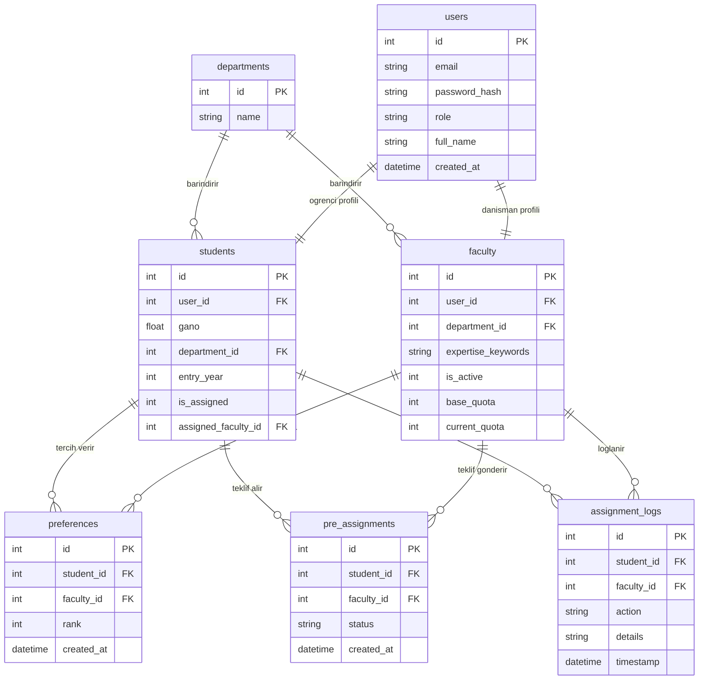
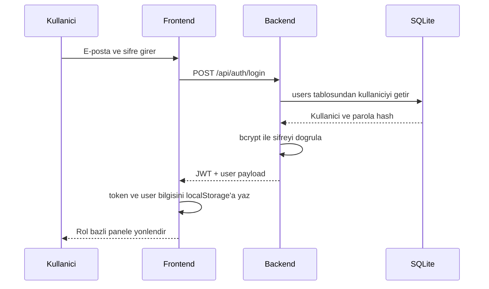
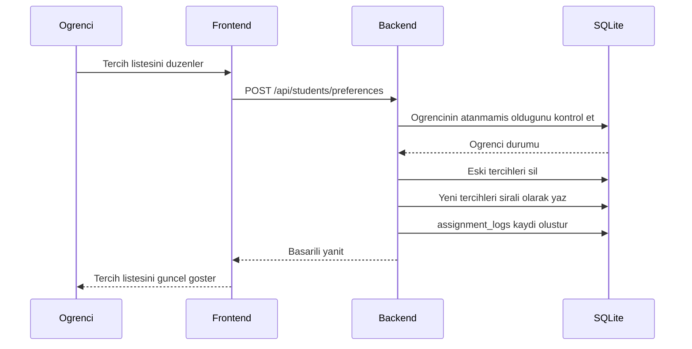
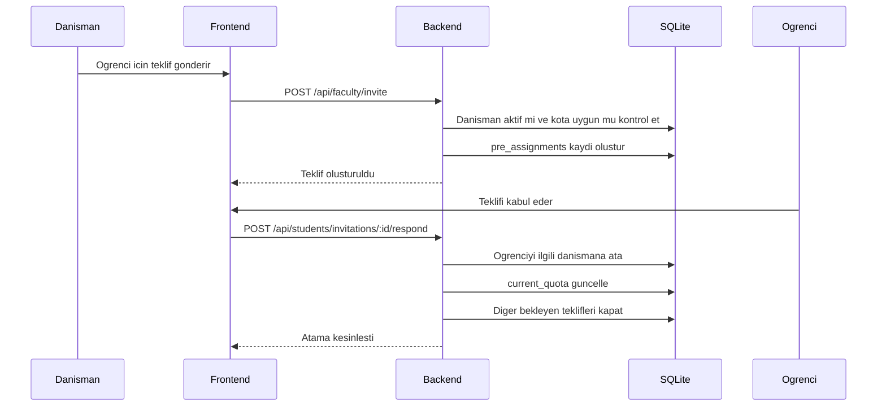

# Mimari ve Akis Dokumani

## Genel Bakis

Danisman Atama Sistemi, ogrenci tercihleri ile danisman tekliflerini ayni akista yoneten bir web uygulamasidir.
Sistem, merkezi yerlestirme asamasinda yalnizca GANO siralamasini otomatik kriter olarak kullanir.
Dogrudan danisman teklifi kabul edilirse ogrenci merkezi yerlestirme sirasindan cikar.

## Temel Is Kurallari

- Merkezi yerlestirmede ogrenciler `GANO DESC` sirasina gore islenir.
- Tercih listesi, ogrencinin hangi aktif danismanlara hangi sirada bakilacagini belirler.
- Danisman manuel teklif gonderebilir; teklif kabul edilirse kontenjan aninda guncellenir.
- Pasif durumdaki danisman yeni teklif gonderemez ve merkezi yerlestirme listesinde kullanilmaz.
- Kontenjan dagitimi aktif danismanlar uzerinden hesaplanir.
- Dagitim, ortalama kota etrafinda dengeli bir profil olusturur:
  - yaklasik `%25` `x + 1`
  - yaklasik `%50` `x`
  - yaklasik `%25` `x - 1`
- Ogrenci sayisi aktif danisman sayisindan az ise "her danismana en az bir ogrenci" kosulu matematiksel olarak saglanamaz; bu durum operasyonel risk olarak ele alinmalidir.

## ER Diyagrami

## Sequence Diyagrami: Sifre ile Giris

## Sequence Diyagrami: Ogrenci Tercih Kaydi

## Sequence Diyagrami: Danisman Dogrudan Teklif Akisi

## Operasyonel Notlar

- Danisman pasife alindiginda yeni teklif gonderemez.
- Pasif danismanin mevcut ogrencileri sistemde kalir; yeniden atama yonetici panelinden yapilir.
- Kullanici silme isleminde bagli veriler kontrollu sekilde temizlenir.
- Danisman silinecekse once bagli ogrenciler ve bekleyen teklifler temizlenmelidir.
